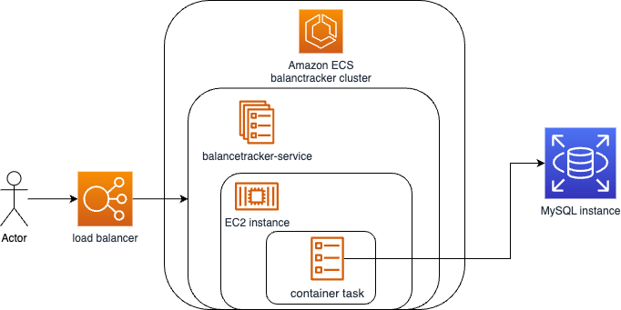
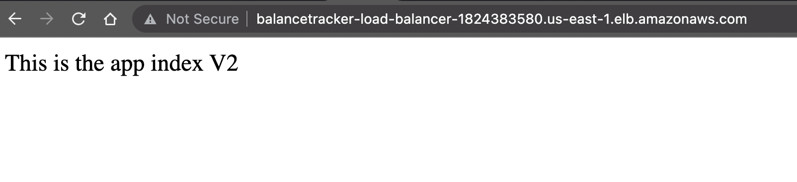
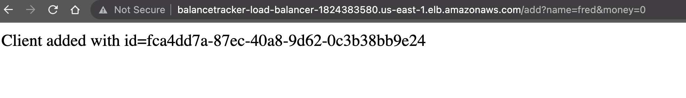
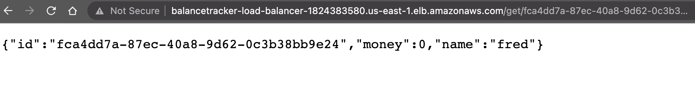
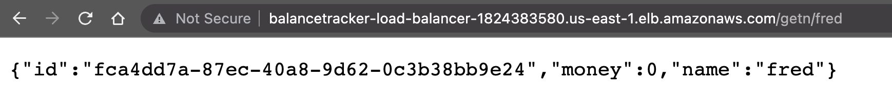
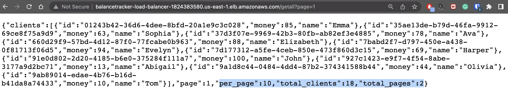
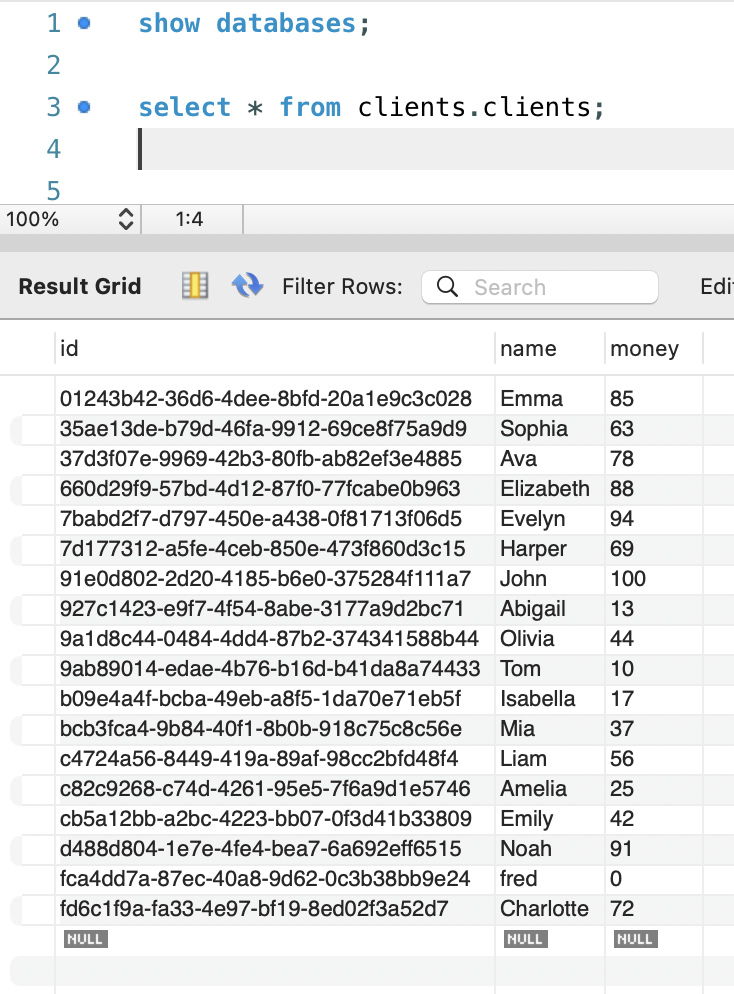

# Demo of Balancetracker 🤑

Welcome to the demo of the Flask app deployed and running online! 🌐

🔗 Try it out for yourself at [http://balancetracker-load-balancer-1824383580.us-east-1.elb.amazonaws.com/](http://balancetracker-load-balancer-1824383580.us-east-1.elb.amazonaws.com/) (use http since it's not a registered domain)

The solution leverages multiple AWS services to bring the app to life. It utilizes an instance of MySQL running on AWS RDS, an ECS cluster with a service hosting a container, and a load balancer to ensure efficient access to the container. The container itself is running on an EC2 instance.

Let's explore the app's endpoints and their functionality:

1. **Index:** The main endpoint of the app, showcasing the latest version.
   

2. **Add User:** An endpoint to add a new user to the system.
   

3. **Get User by ID:** Retrieve a user's information by providing their ID.
   

4. **Get User by Name:** Retrieve a user's information by providing their name.
   

5. **Get All Users (with Pagination):** Fetch all users from the database using pagination.
   

Finally, let's take a look at the database, where we can see that there are more than 10 clients in the table.

Feel free to explore the app, interact with the different endpoints, and experience the seamless integration of Flask, AWS services, and a MySQL database.

Happy exploring! 🎉