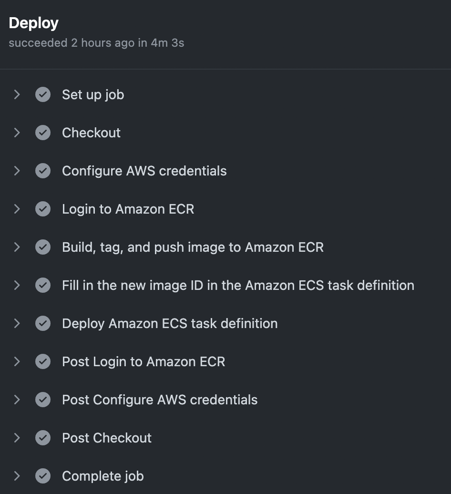
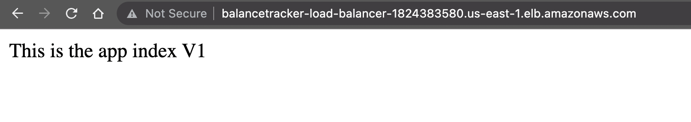
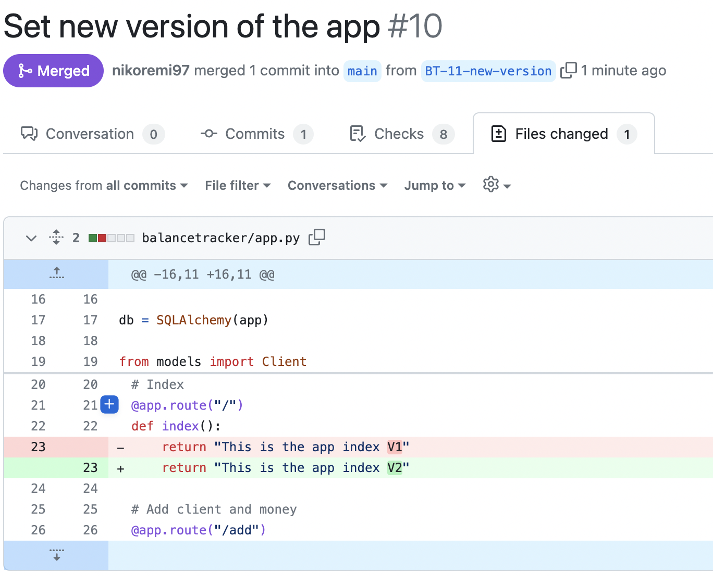
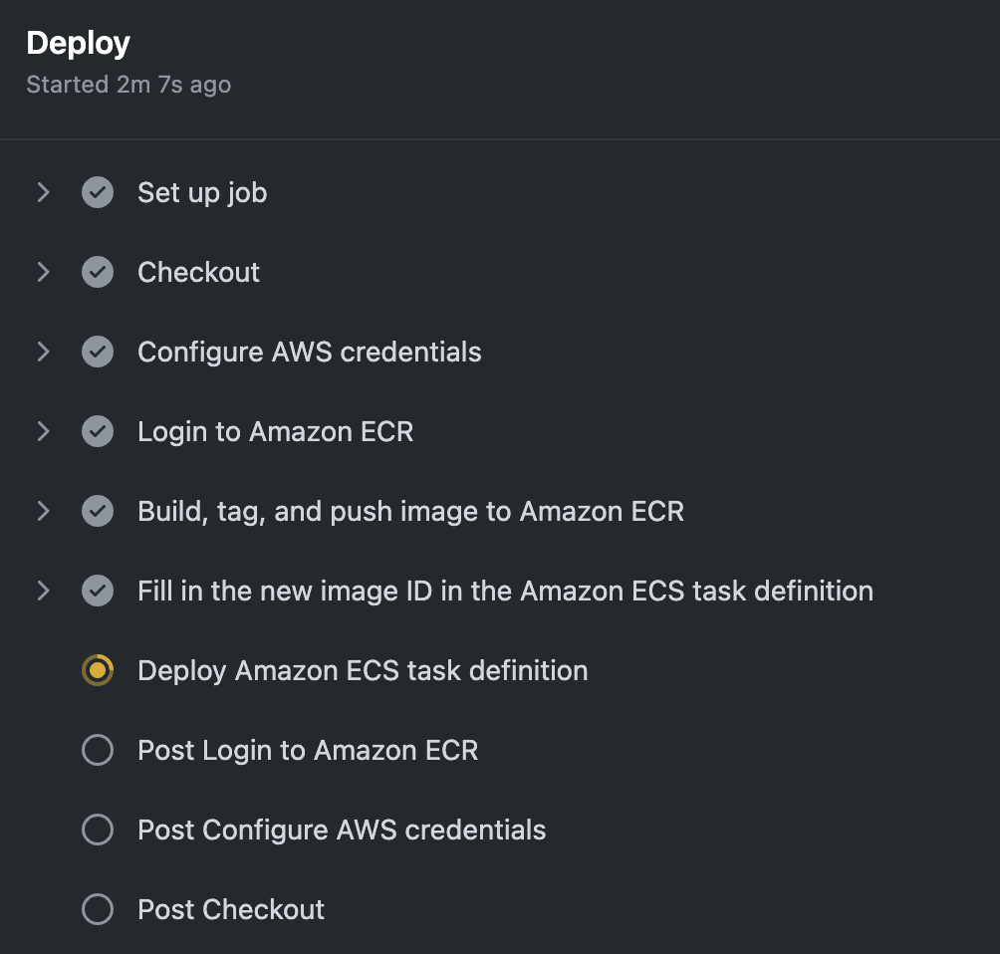
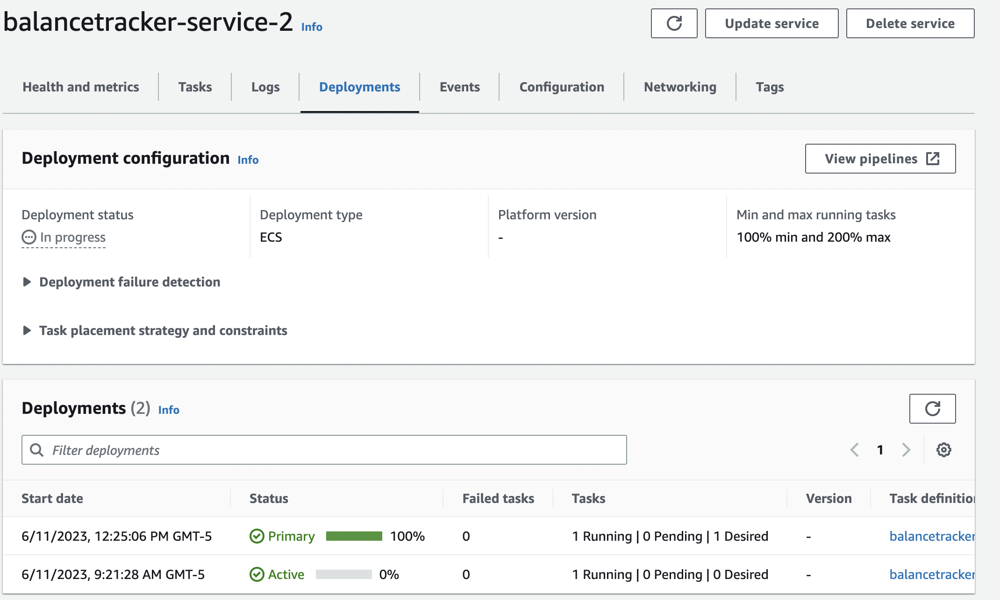
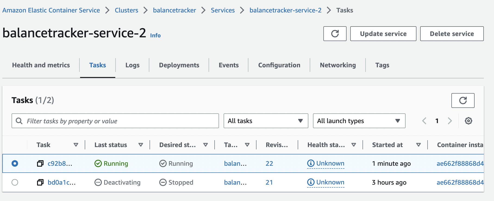
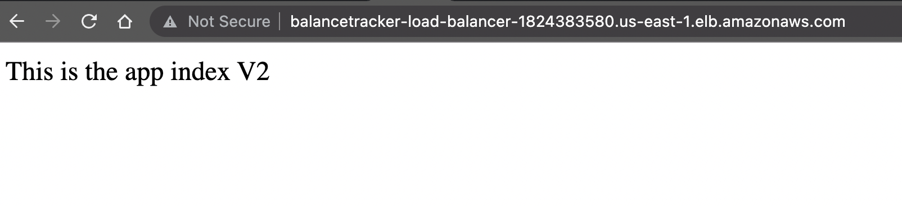

# Demo of AWS deployment workflow

🚀 This project's core functionality is driven by a crucial workflow that necessitates the creation of multiple resources. While the majority of these resources are defined in Terraform, there are a few exceptions, including secrets, users, and access keys.

The deployment workflow for Amazon ECS is triggered upon merging a pull request and is defined in the `.github/workflows/deploy-aws.yaml` file. Here's an overview of how it operates:

1️⃣ Once a pull request is merged, the workflow is automatically triggered.

2️⃣ The workflow sets up the essential environment variables and secrets. These secrets have the access keys of an AWS user with the necessary permissions to build and push container images to ECR. Additionally, a new version of the ECS task definition is created.

3️⃣ The new version of the task definition triggers the deployment of a fresh task within the ECS service. The service is specifically configured to deploy the new task using the updated task definition. Once the new task is successfully deployed, the previous task gracefully terminates.

🔄 This workflow streamlines the deployment process, allowing for seamless updates to the application on Amazon ECS while efficiently managing task versions 🚀

## Let's see it working... 👀
We have a V1 version serving to the users and we want to update the version as V2:

What we have to do:
1️⃣ First, a new PR is merged:

2️⃣ A new job starts to deploy a new version of the ECS Task Definition:

3️⃣ Once the new task is complete, the service triggers a new deployment:

4️⃣ A new task is deployed, and the old one is scheduled to stop:

5️⃣ And finally, a new version of the app is deployed to the web 🎉🎉:

