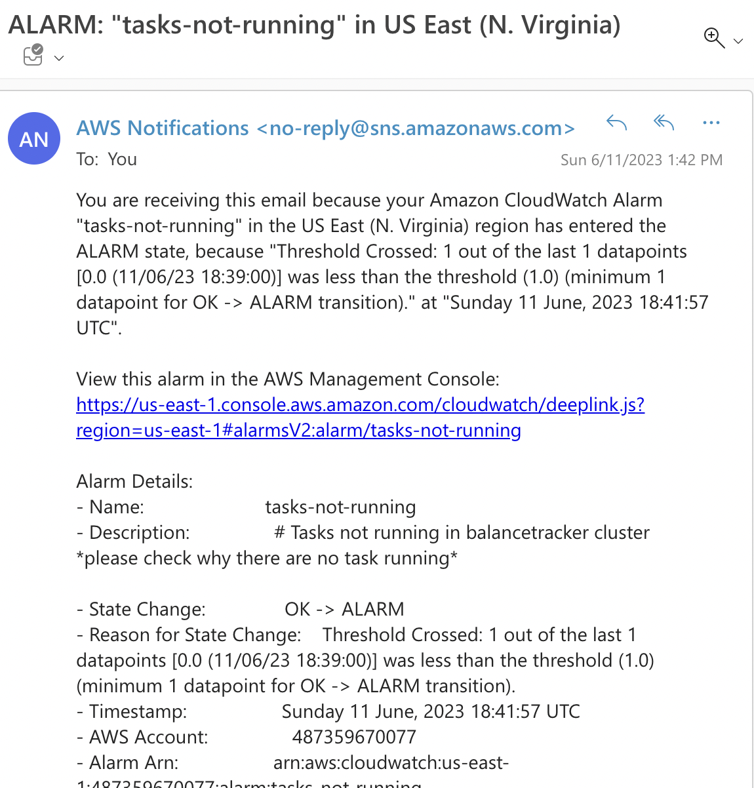

# 📊 Demo of Monitoring the tasks with CloudWatch

As part of the project, I have implemented a robust monitoring system using AWS CloudWatch. This allows us to closely track the status of our tasks within the service and promptly address any potential issues.

✅ When everything is running smoothly, the alarm indicates an optimal state:

⚠️ To simulate an event, I intentionally stopped a running task:

🚨 As a result, the alarm is triggered and its status changes to indicate an alert:

📧 Additionally, an email notification is automatically sent, providing a detailed description of the alarm:

This robust monitoring setup ensures that we can proactively respond to any potential disruptions in our task execution and maintain the reliability of our services.
