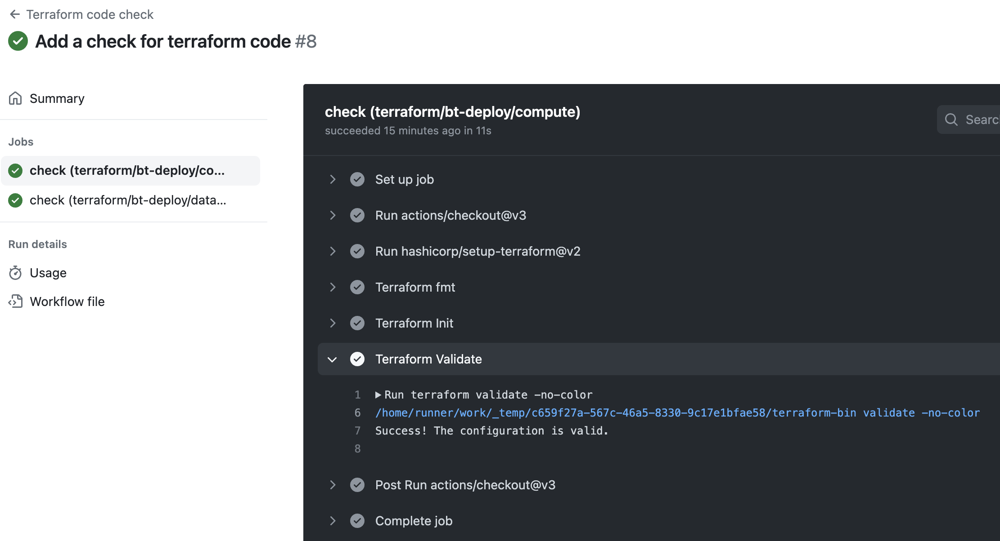
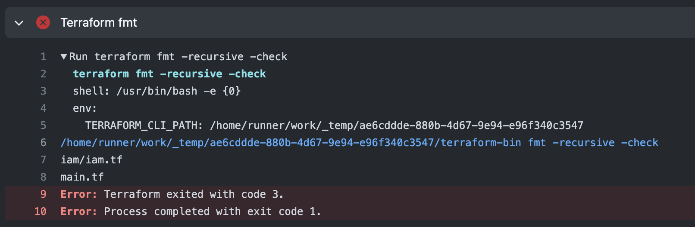

# 🏗️ Demo of Terraform workflow

The Terraform workflow, defined in `.github/workflows/terraform-check.yaml`, ensures the quality of Terraform code by validating its indentation and verifying the correctness of the configuration. ✅🔍

The workflow scans the two Terraform directories within the project. After a successful job completion, you can observe the following image ✨:

However, if the code indentation is incorrect, the job will fail ❌:

Similarly, if the configuration is invalid, the workflow will fail ❌:

Reference: [HashiCorp Setup Terraform](https://github.com/marketplace/actions/hashicorp-setup-terraform) 📚