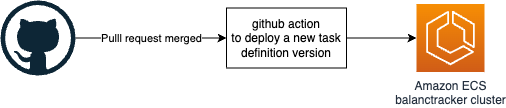
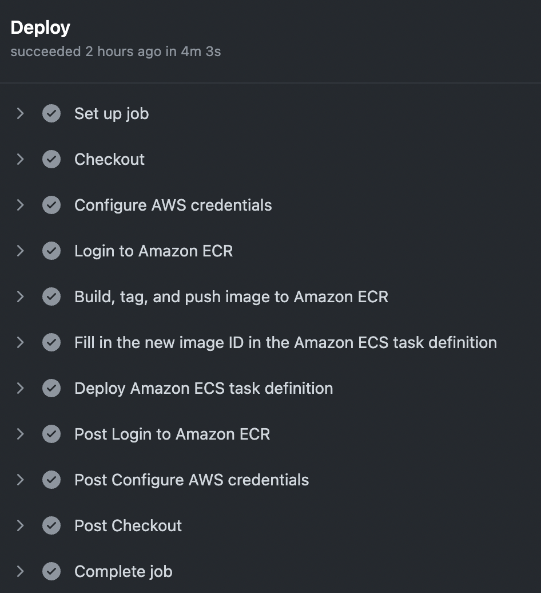
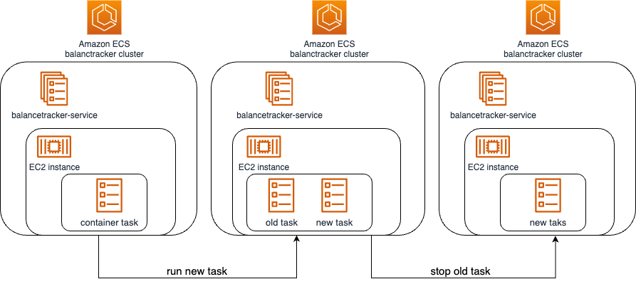

# Demo of AWS deployment workflow

This project's core functionality is driven by a crucial workflow that necessitates the creation of multiple resources. While the majority of these resources are defined in Terraform, there are a few exceptions, including secrets, users, and access keys.

The deployment workflow for Amazon ECS is triggered upon merging a pull request and is defined in the `.github/workflows/deploy-aws.yaml` file. Here's an overview of how it operates:

1) Once a pull request is merged, the workflow is automatically triggered.

2) The workflow sets up the essential environment variables and secrets. These secrets have the access keys of an AWS user with the necessary permissions to build and push container images to ECR. Additionally, a new version of the ECS task definition is created.

3) The new version of the task definition triggers the deployment of a fresh task within the ECS service. The service is specifically configured to deploy the new task using the updated task definition. Once the new task is successfully deployed, the previous task gracefully terminates.

This workflow streamlines the deployment process, allowing for seamless updates to the application on Amazon ECS while efficiently managing task versions.

