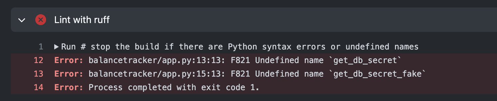

# Demo of Python workflow

The Python workflow, defined in `.github/workflows/python-code-check.yaml`, is responsible for installing all the necessary requirements and utilizing Ruff to validate code correctness. Additionally, it verifies the accuracy of tests while allowing the workflow to continue despite encountering errors because it's not the scope for this demo/project. 

Here's a capture when ruff detect an error:

And here's a capture of the warnings of the pipeline:
