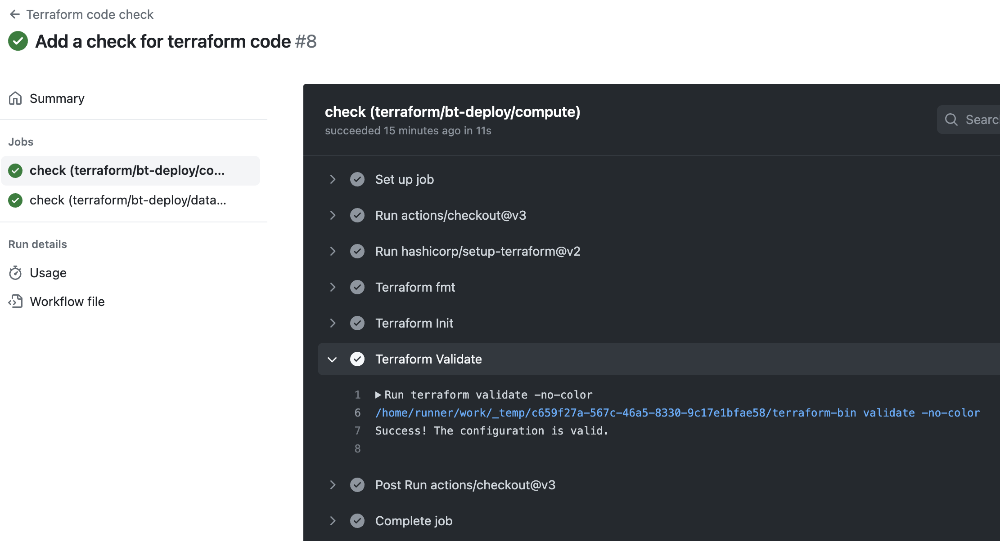
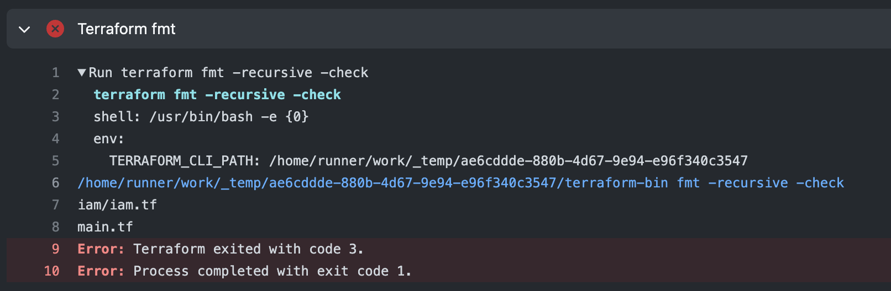
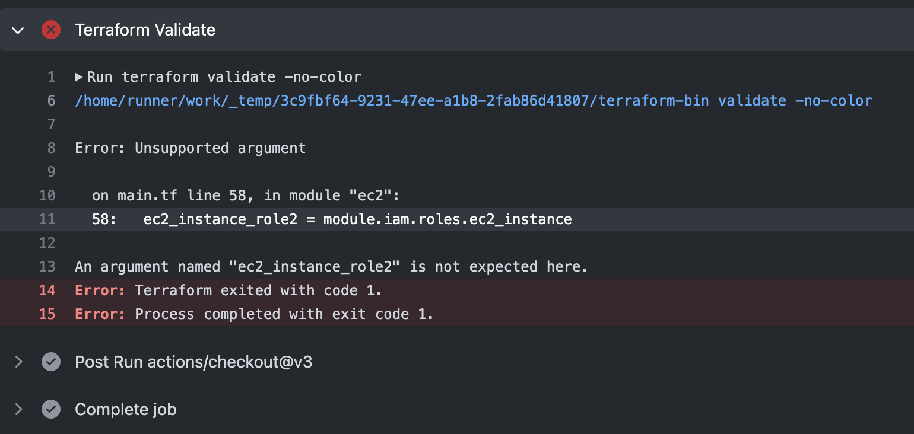

# Demo of Terraform workflow

The Terraform workflow is defined in `.github/workflows/terraform-check.yaml`. Its purpose is to validate the indentation of Terraform code and ensure the correctness of the configuration.

The workflow checks the two Terraform directories in the project. Upon successful completion of the job, you will be able to view an image as shown below:

If the code indentation is incorrect, the job will fail:

If the configuration is invalid, the workflow will fail:

reference: https://github.com/marketplace/actions/hashicorp-setup-terraform